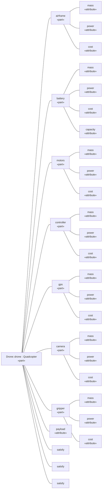

# Delivery Drone Design Report

Components, requirements and traceability of the delivery drone, generated from the model by OpenSysML.

## Bill of materials

<!-- caption -->
*Components, heaviest first*

| name | mass | power | cost | costPerKg | label |
| --- | --- | --- | --- | --- | --- |
| battery | 4.4 | 0 | 900 | 204.54545454545453 | part: battery |
| airframe | 3.2 | 0 | 450 | 140.625 | part: airframe |
| camera | 0.6 | 15 | 700 | 1166.6666666666667 | part: camera |
| motors | 0.55 | 0 | 160 | 290.9090909090909 | part: motors |
| gripper | 0.4 | 5 | 150 | 375 | part: gripper |
| controller | 0.25 | 12 | 380 | 1520 | part: controller |
| gps | 0.1 | 2 | 120 | 1200 | part: gps |

## Safety-critical components

<!-- caption -->
*Components marked @SafetyCritical*

| name | qualifiedName |
| --- | --- |
| battery | Drone::drone::battery |
| motors | Drone::drone::motors |
| controller | Drone::drone::controller |

## Requirements

<!-- caption -->
*Requirements by identifier*

| shortName | name | type |
| --- | --- | --- |
| R-01 | mtow | Drone::MaxTakeoffMass |
| R-02 | flightTime | Drone::MinFlightTime |
| R-03 | deliveryLoad | Drone::MinPayload |

<!-- caption -->
*Parts satisfying R-01*

| name | qualifiedName |
| --- | --- |
| drone | Drone::drone |

## Structure

<!-- caption -->
*Drone part tree*

